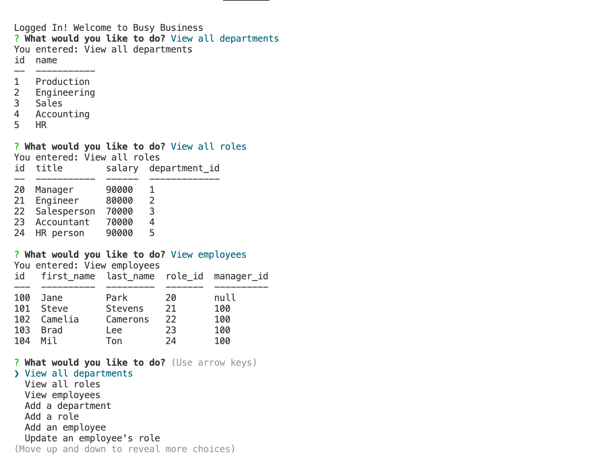

# Busy Business

Busy Business is Content Management System designed to assist an employer in viewing and managing their employees. It is a command-line application which takes in requests and returns information as well as updating and adding data.

## Table of Contents

1.  [Installation](#installation)
2.  [Usage](#usage)
3.  [License](#license)
3.  [Credits](#credits)
4.  [Questions](#questions)

## Installation 

1. Clone my repository to your local device 
2. Open the integrated terminal and run "npm i"
3. Run "mysql -u root -p" and enter your password to log into mysql
4. Run "SOURCE db/schema.sql;" then "SOURCE db/seeds.sql;" and "quit" to initialise the database
5. Run "npm start" to begin Busy Business

## Usage

This application would be used by a manager to easily keep track of their employees, providing useful information for the purpose of budgeting, assessing productivity and determining where hiring needs to take place. Click [here](https://drive.google.com/file/d/15zWeIBkN8SJUTUg3axeeK4HXQUZOUeRK/view) to see a live demo!

## License
This project is created under the MIT license

## Credits
This project was created by [kieranmichaelflynn](https://github.com/kieranmichaelflynn)

## Questions
To see it yourself, visit my GitHub repository at https://github.com/kieranmichaelflynn/Busy-Business.git

If you have any further questions, reach out to me at kieranmichaelflynn@gmail.com 

Thank you for reading, enjoy Busy Business!
    
